# Projekt: Problem odnajdywania ścieżek w przestrzeni 3D #
### Autorzy ###

Mateusz Politycki 145263, Marcin Korcz 144446

### Streszczenie ###
Autorzy projektu zaprojektowali i zaimplementowali algorytmy w języku Python poszukiwania ścieżki w przestrzeni 3D. Przedstawione zostały dwa algorytmy: Dijkstry oraz A*. Wyniki zwizualizowano przy pomocy gry Minecraft wykorzystując MinecraftAPI.
## Słowa kluczowe: ##
  * <a href="https://pl.wikipedia.org/wiki/Reprezentacja_grafu">Reprezentacja Grafu</a>
  * <a href="https://pl.wikipedia.org/wiki/Problem_najkr%C3%B3tszej_%C5%9Bcie%C5%BCki">Problem najkrótszej ścieżki</a>
  * <a href="https://pl.wikipedia.org/wiki/Algorytm_A*">Algorytm A*</a>
  * <a href="https://pl.wikipedia.org/wiki/Algorytm_Dijkstry">Algorytm Dijkstry</a>


### Metodyka pracy grupowej ###
  - Wybranie tematu projektu: Problem odnajdywania ścieżek w przestrzeni 3D.
  - Dogłębne zapoznanie się z materiałami w celu zrozumienia zagadnienia.
  - Rozplanowanie pracy:
    * Utworzenie interfejsu wizualizującego algorytmy w środowisku Minecraft
    * Mateusz:
      * zaimplementowanie algorytmu A*.
      * dodanie funkcji potrzebnych w realizacji projektu.
    * Marcin:
      * zaimplementowanie algorytmu Dijkstry.
      * utworzenie algorytmów generujących labirynty w przestrzeni trójwymiarowej.
  - Wstępna konsultacja z prowadzącym zajęcia.
  - Testowanie i wprowadzanie poprawek w kodzie.
  - Prezentacja projektu.

### Wybór technologii ###
  * Python 3.8
  * Minecraft
  * Minecraft API
## Zestawienie licencji ##
  * Minecraft Java Edition
# Wprowadzenie #
### Poszukiwanie ścieżki w przestrzeni 3D ###
Problem poruszony w projekcie polega na znalezieniu ścieżki w labiryncie w przestrzeni 3D z punktu **A** do punktu **B**. Zakładamy, iż z danego punktu będącego sześcianem, można poruszać się jedynie w sześciu kierunkach prostopadłych do jego ścian. W naszej pracy sprowadziliśmy omawianą kwestię do zagadnienia teorii grafów.

### Dane wejściowe ###
**maze** - tablica trójwymiarowa, będąca reprezentacją labiryntu w przestrzeni 3D, w której oznaczone zostały przeszkody oraz punkt startowy i końcowy.
  * **' '** - pole, po którym można się przemieszczać,
  * **'#'** - pole, po którym **nie można** się przemieszczać,
  * **'0'** - punkt startowy **A**,
  * **'X'**- punkt końcowy **B**
Przykładowe losowo wygenerowane dane wejściowe:
```python
maze = [[[' ', ' ', ' '], ['#', '#', ' '], [' ', ' ', '#']],
        [[' ', ' ', ' '], [' ', 'X', ' '], ['0', '#', ' ']],
        [[' ', ' ', ' '], [' ', ' ', '#'], [' ', ' ', ' ']]]
```        

#### Losowe generowanie danych wejściowych ####
Funkcja **createMaze3d** z parametrami **n** oraz **r**, gdzie **n** oznacza jednostkową długość boku w przestrzeni trójwymiarowej będącej sześcianem, a **r** jest gęstością pól, po których nie można się przemieszczać.
```python
def createMaze3d(n, r):
    maze = []

    for i in range(n):
        maze.append([])
        for j in range(n):
            maze[i].append([])
            for k in range(n):
                temp = random.randint(0, 100)
                if temp < r * 100:
                    maze[i][j].append("#")
                else:
                    maze[i][j].append(" ")

    x_start, y_start, z_start = random.randint(0, n-1), random.randint(0, n-1), random.randint(0, n-1)
    maze[x_start][y_start][z_start] = "0"

    x_stop, y_stop, z_stop = random.randint(0, n-1), random.randint(0, n-1), random.randint(0, n-1)
    while x_stop == x_start and y_stop == y_start and z_stop == z_start:
        x_stop, y_stop, z_stop = random.randint(0, n-1), random.randint(0, n-1), random.randint(0, n-1)
    maze[x_stop][y_stop][z_stop] = "X"

    return maze
```

#### Sprowadzenie do zagadnienia z teorii grafów ####
Lista sąsiedztwa stworzona z wygenerowanych danych:
```python
ngb = [[1, 9], [0, 2, 4, 10], [1, 5, 11], [], [5, 1, 7, 13], [4, 2, 8, 14], [7, 15], [6, 8, 4], [7, 5, 17],
 [10, 0, 18], [9, 11, 13, 1, 19], [10, 14, 2, 20], [], [14, 10, 4, 22], [13, 11, 17, 5], [6], [], [14, 8, 26],
 [19, 21, 9], [18, 20, 22, 10], [19, 11], [22, 18], [21, 19, 25, 13], [], [], [26, 22], [25, 17]]
```
Funkcja **ngb_from_maze** konwertuje tablice trójwymiarową **maze** do listy sąsiedztwa **ngb**.

```python
def ngb_from_maze(maze, n):
    ngb = [[] for _ in range(n * n * n)]

    for i in range(n * n * n):
        x, y, z = v_to_xyz(i, n)
        if maze[x][y][z] == "#":
            continue
        else:
            temp = i % (n * n)
            if temp % n == n - 1:
                continue
            else:
                x, y, z = v_to_xyz(i + 1, n)
                if maze[x][y][z] == "#":
                    continue
                else:
                    ngb[i].append(i + 1)
                    ngb[i + 1].append(i)

    for i in range(n * n * n):
        x, y, z = v_to_xyz(i, n)
        if maze[x][y][z] == "#":
            continue
        else:
            temp = i % (n * n)
            temp = temp // n
            if temp % n == n - 1:
                continue
            else:
                x, y, z = v_to_xyz(i + n, n)
                if maze[x][y][z] == "#":
                    continue
                else:
                    ngb[i].append(i + n)
                    ngb[i + n].append(i)

    for i in range(n * n * n - n * n):
        x, y, z = v_to_xyz(i, n)
        if maze[x][y][z] == "#":
            continue
        else:
            x, y, z = v_to_xyz(i + n * n, n)
            if maze[x][y][z] == "#":
                continue
            else:
                ngb[i].append(i + n * n)
                ngb[i + n * n].append(i)

    return ngb

```

Funkcja **v_to_xyz** zamienia wierzchołek na współrzędne w przestrzeni 3D.
```python
def v_to_xyz(v, n):
    z = v // (n * n)
    temp = v % (n * n)
    y = temp // n
    x = temp % n
    return x, y, z
```

#### Rozwiązanie dla przykładowych danych ####
Wygenerowana ścieżka:
```python
path = [[1, 2, 0], [1, 1, 0], [1, 1, 1]]
```
Wizualizacja w Minecraft:

<p align="center">
  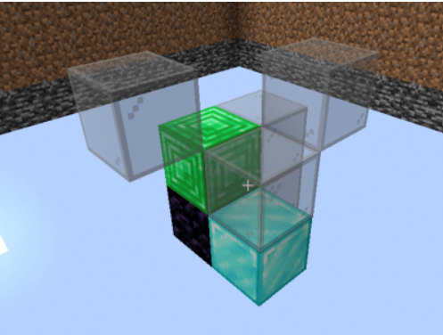
</p>


# Algorytmy rozwiązujące zagadnienie #

### Algorytm Dijkstry ###
Algorytm Dijkstry znajduje w grafie wszystkie najkrótsze ścieżki pomiędzy wybranym wierzchołkiem a wszystkimi pozostałymi, przy okazji wyliczając również koszt przejścia każdej z tych ścieżek. Jest to przykład algorytmu zachłannego.


Funkcja **a_dikstry** implementuje algorytm Dijkstry, gdzie:
  * **ngb** - lista sąsiedztwa,
  * **n** - jednostkowa długość boku
  * **v_start** - punkt początkowy
  * **v_stop** - punkt końcowy

| Zmienne | Opis |
| :-------: | :----: |
| **S** | zbiór wierzchołków grafu o policzonych już najkrótszych ścieżkach od wybranego wierzchołka **v** |
| **Q** | zbiór wierzchołków grafu, dla których najkrótsze ścieżki nie zostały jeszcze policzone |
| **d** | **n<sup>3**  elementowa tablica z kosztami dojścia od wierzchołka **v**  do wierzchołka **i**-tego wzdłuż najkrótszej ścieżki |
| **p** | **n<sup>3**  elementowa tablica z poprzednikami wierzchołków na wyznaczonej najkrótszej ścieżce |

```python
def a_dijkstry(ngb, n, v_start, v_stop):
    S = []
    Q = v_in_Q(ngb)
    d = []
    p = []

    for i in range(n * n * n):
        d.append(1000)
        p.append(-1)

    d[v_start] = 0

    while Q != []:
        u = min_in_Q(Q, d)
        if u == -1:
            return p, False
        Q.remove(u)
        S.append(u)
        for w in ngb[u]:
            if w not in Q:
                continue
            if d[w] > d[u] + 1:
                d[w] = d[u] + 1
                p[w] = u
            if w == v_stop:
                return p, True

    return p, False

```

Funkcja **v_in_Q** zwraca tablice wierzchołków, które posiadają sąsiadów.
```python
def v_in_Q(ngb):
    Q = []
    for i in range(len(ngb)):
        if ngb[i] != []:
            Q.append(i)
    return Q
```


Funkcja **min_in_Q** wyszukuje w zbiorze **Q** wierzchołka o najmniejszym koszcie dojścia.
```python
def min_in_Q(Q, d):
    m = d[Q[0]]
    v = Q[0]
    for i in Q:
        if d[i] < m:
            m = d[i]
            v = i
    if m == 1000:
        return -1
    return v

```


### Algorytm A* ###
Algorytm A* wybiera wierzchołek **x** dostępny z niezbadanych w danym kroku wierzchołków tworząc ścieżkę w taki sposób, aby minimalizować funkcje **f(x) = g(x) + h(x)**, gdzie:
  * **g(x)** - droga między wierzchołkiem początkowym, a **x**,
  * **h(x)** - przewidywana przez heurystykę droga od **x** do wierzchołka końcowego.
Jest to przykład algorytmu heurystycznego.


Funkcja **a_A** implementuje algorytm A*, gdzie:
  * **ngb** - lista sąsiedztwa,
  * **n** - jednostkowa długość boku
  * **v_start** - punkt początkowy
  * **v_stop** - punkt końcowy


| Zmienne | Opis |
| ------- | ---- |
| **Q** | kolejka priorytetowa, w której umieszczane są wierzchołki do odwiedzenia w odpowiedniej kolejności |
| **From** | **n<sup>3** elementowa tablica z poprzednikami wierzchołków w najkrótszej ścieżce |
| **Cost** | **n<sup>3**  elementowa tablica z kosztami dojścia od wierzchołka startowego  do wierzchołka i-tego wzdłuż najkrótszej ścieżki |

```python

def a_A(ngb, n, v_start, v_stop, mc):
    Q = PriorityQueue()
    From = [-1 for _ in range(n * n * n)]
    Cost = [-1 for _ in range(n * n * n)]
    Q.put((0, v_start))
    Cost[v_start] = 0

    while not Q.empty():
        v = Q.get()[1]
        if v == v_stop:
            return From, True

        for u in ngb[v]:
            new_cost = Cost[v] + 1
            if Cost[u] == -1 or new_cost < Cost[u]:
                Cost[u] = new_cost
                priority = new_cost + heuristic_euk(v_stop, u, n)
                Q.put((priority, u))
                From[u] = v

    return From, False
```

Funkcja **heuristic_euk**, gdzie **a** i **b** są wierzchołkami, między którymi liczona jest odległość, implementuje heurystykę Euklidesa:

```python
def heuristic_euk(a, b, n):
    x1, y1, z1 = v_to_xyz(a, n)
    x2, y2, z2 = v_to_xyz(b, n)
    return math.sqrt((x1 - x2) * (x1 - x2) + (y1 - y2) * (y1 - y2) + (z1 - z2) * (z1 - z2))

```


# Wizualizacja i testy działania algorytmów #
### Wizualizacja ###
Dla obu algorytmów wykonano trzy jednakowe labirynty z danymi parametrami:
  - **Labirynty 1**
    * **Dane**:
      * maze = createMaze3d(20,0.0)
      * v_start = [10,15,11]
      * v_stop = [10,5,9]
  - **Labirynty 2**
    * **Dane**:
      * maze = createMaze3d(20,0.0)
      * v_start = [5,5,5]
      * v_stop = [15,15,15]
  - **Labirynty 3**
    * **Dane**:
      * maze = exampleMaze3dRods(20,0.2)
      * v_start = [5,5,5]
      * v_stop = [15,15,15]

#### Algorytm A* ####
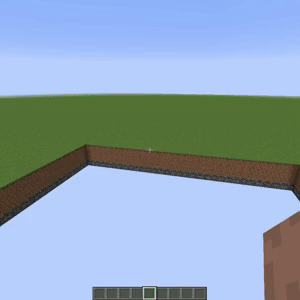
 

#### Algorytm Dijkstry ####
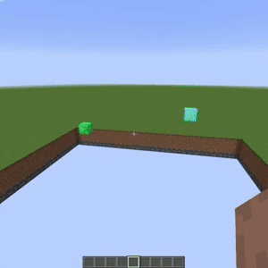
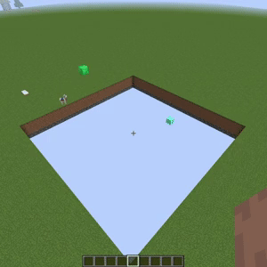


### Funkcja exampleMaze3dRods ###
Funkcja tworząca przykładowy labirynt złożony z prętów, użyta w teście numer 3, gdzie **d** oznacza gęstość przeszkód.

```python
def exampleMaze3dRods(n, d):
    d = d * n * n
    l = int(d)
    maze = []
    for i in range(n):
        maze.append([])
        for j in range(n):
            maze[i].append([])
            for k in range(n):
                maze[i][j].append(" ")
    used = []
    while l > 0:
        x = random.randint(1, n-1)
        y = random.randint(1, n-1)
        if [x,y] not in used:
            used.append([x,y])
            l-=1

    for coord in used:
        for j in range(n):
            hole_chance = random.randint(1, 20)
            if hole_chance != 1:
                maze[coord[0]][j][coord[1]] = "#"
    maze[5][5][5] = "0"
    maze[n - 5][n - 5][n - 5] = "X"

    return maze
```
### Wykresy ###
Wykresy przedstawiają liczbę sprawdzanych bloków dla każdego z algorytmów w danych konfiguracjach:
  - Brak przeszkód
    - Punkty A i B umieszczone po przeciwległych rogach sześcianu.
    - Punkty A i B: 2 współrzędne umieszczone w odległości 4 od końca rozpatrywanej przestrzeni. Ostatnia współrzędna jest taka sama dla obu punktów.
    - Losowe rozmieszczenie obu punktów
  - z przeszkodami losowe rozmieszczenie obu punktów
    - ''d = 0.2''
    - ''d = 0.5''
Poniższe wykresy przedstawiają uśrednione wartości sprawdzonych bloków oraz czasów wykonania algorytmów przy 10 próbach dla podanych wielkości n.

<p align="center">
  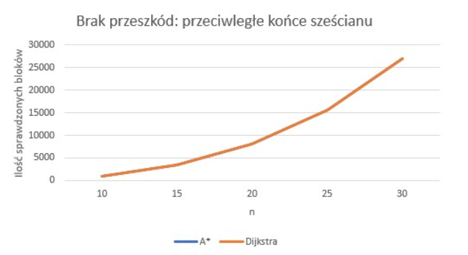
</p>
<p align="center">
  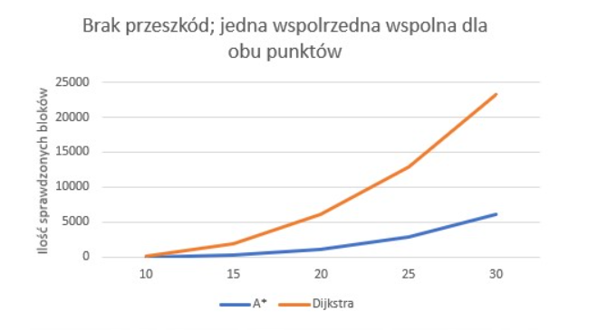
</p>
<p align="center">
  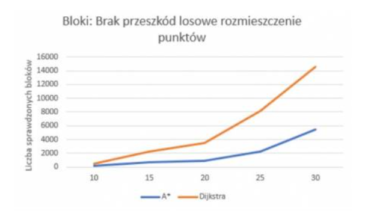
</p>
<p align="center">
  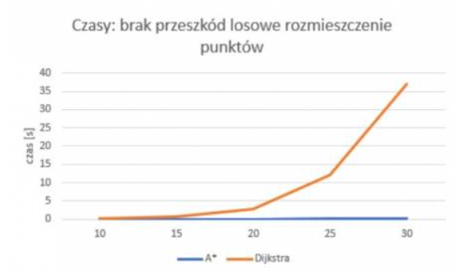
</p>
<p align="center">
  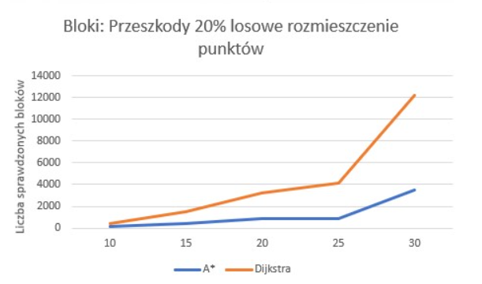
</p>
<p align="center">
  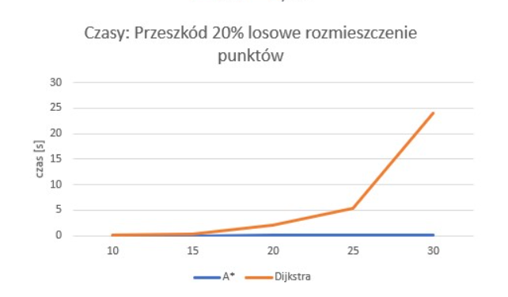
</p>
<p align="center">
  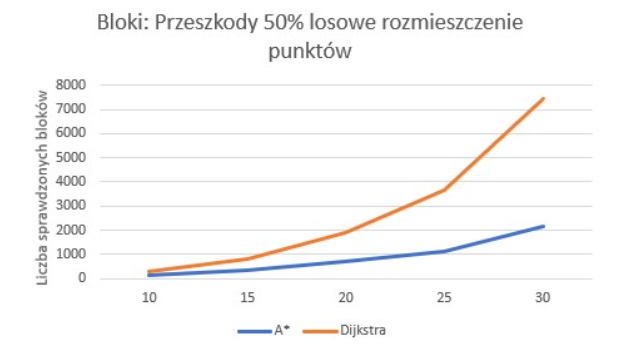
</p>
<p align="center">
  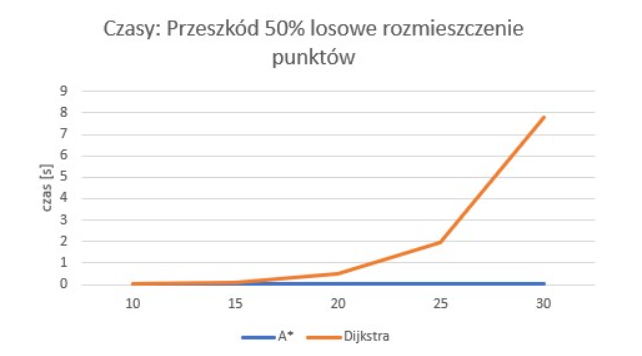
</p>

#### Zaobserwowane zależności ####
Algorytm A* sprawdza mniejszą liczbę bloków, niżeli Algorytm Dijkstry. Wyjątkiem od tej reguły jest przypadek gdy punkty znajdują się w przeciwległych rogach sześcianu. Zatem można stwierdzić, iż algorytm A* prawie zawsze
będzie lepszym rozwiązaniem.

### Test poprawności rozwiązania ###
Funkja **testIfValid** sprawdza, czy wygenerowana ścieżka jest poprawna pod kątem połączenia punktu startowego i końcowego oraz przechodzenia jedynie przez pola nie będące przeszkodami.
  * **path** - ścieżka wygenerowana przez algorytm
  * **maze** -  tablica trójwymiarowa, będąca reprezentacją labiryntu w przestrzeni 3D
  * **start** - współrzędne punktu startowego
  * **stop** - współrzędne punktu końcowego

```python
def testIfValid(path, maze, start, stop):
    if path[0] == start and path[-1] == stop:
        for i in range(len(path) - 1):
            a = path[i]
            b = path[i + 1]
            if abs(a[0] - b[0]) + abs(a[1] - b[1]) + abs(a[2] - b[2]) == 1:
                if i + 1 == len(path) - 1 and b == stop:
                    return True
                elif maze[b[0]][b[1]][b[2]] == ' ':
                    continue
            else:
                break
    return False

```

## Podsumowanie ##
### Analiza złożoności ###
#### Algorytm Dijkstry ####
Złożoność czasowa algorytmu Dijkstry zależy od implementacji kolejki priorytetowej. W prezentowanych przykładach odległości od źródła dla wszystkich wierzchołków przechowywane są w tablicy, stąd jego złożoność wynosi **O(V<sup>2</sup>)**, gdzie **V** to liczba wszystkich bloków, które posiadają minimum jednego sąsiada, do którego możliwy jest dostęp.
#### Algorytm A* ####
Złożoność czasowa A* w ogólności zależy od heurystyki. W najgorszym przypadku pokryje się ona z algorytmem Dijkstry i wyniesie **O(V<sup>2</sup>)**. Praktycznie sprowadza się ona do **O(b<sup>d</sup>)** gdzie **b** to współczynnik rozgałęzienia, natomiast **d** to długość najkrótszej ścieżki. Generalizując, miarą działania algorytmów heurystycznych jest liczba sprawdzonych bloków przed uzyskaniem rozwiązania. Heurystyka pozwala uniknąć przeszukiwania w nieodpowiednich kierunkach, a jej jakość można wyrazić za pomocą efektywnego współczynnika rozgałęzienia ** b<sup>*</sup> **, który można określić empirycznie dla wystąpienia problemu, mierząc liczbę odwiedzonych węzłów - **N** i długość ścieżki **d**:
 


Poniżej znajduje się przykładowy wykres zależności współczynnika, na którym można zauważyć, iż wartość zbliża się do 1 dla algorytmów silnie zorientowanych na cel.
https://www.sciencedirect.com/topics/computer-science/branching-factor

<p align="center">
  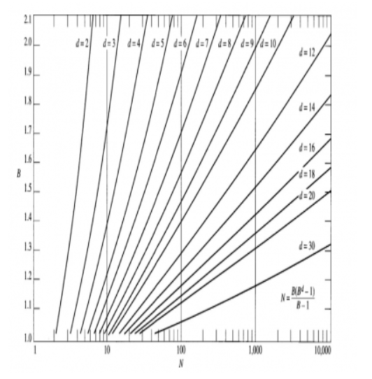
</p>


### Wnioski ogólne ###
**Algorytm A*** jest pewnym uogólnieniem **algorytmu Dijkstry**, który dzięki zastosowaniu odpowiedniej heurystyki pozwala przeszukiwać tylko część bloków, co wpływa na jego złożoność obliczeniową. Warto zauważyć także, iż w przypadku, gdy koszt przejścia z jednego punktu do kolejnego byłby ujemny **algorytm Dijkstry** nie mógł by zadziałać, a w prezentowanych przypadkach, gdy koszt ten jest stały, można go zastąpić algorytmem przeszukiwania grafu wszerz.

Dodatkowo należy zwrócić uwagę, iż do działania **algorytmu A*** potrzebna jest znajomość punktu końcowego, z czego wynika, iż taki cel musi w ogóle istnieć, choć nie jest wymagane, aby istniała do niego ścieżka. Natomiast **algorytm Dijkstry** zadziała także w momencie, gdy w labiryncie nie znajduje się punkt końcowy i zwróci informacje o braku ścieżki.


#### Literatura ####
  - https://www.sciencedirect.com/topics/computer-science/branching-factor
  - https://en.wikipedia.org/wiki/Pathfinding
  - https://en.wikipedia.org/wiki/A*_search_algorithm
  - https://en.wikipedia.org/wiki/Dijkstra%27s_algorithm
  - https://www.redblobgames.com/pathfinding/


